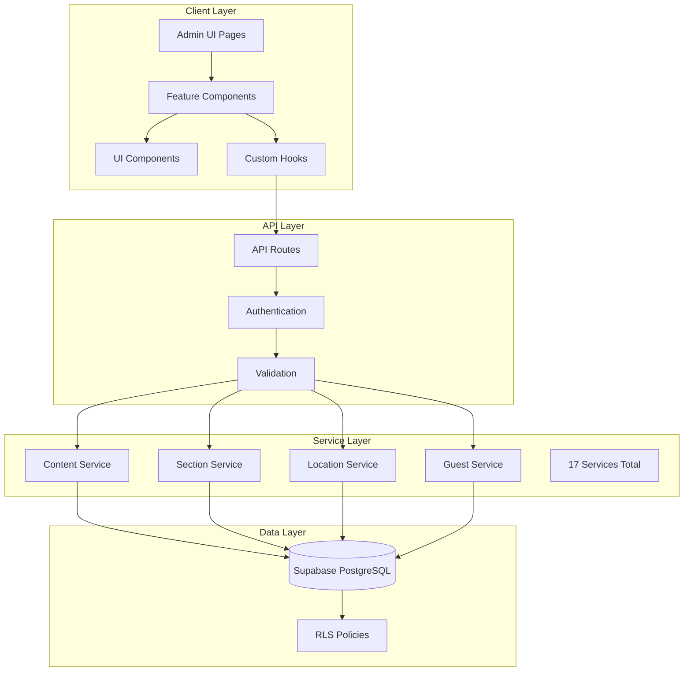
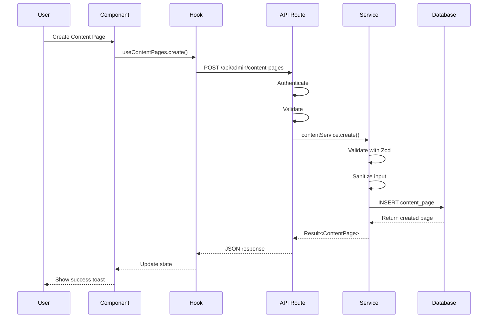
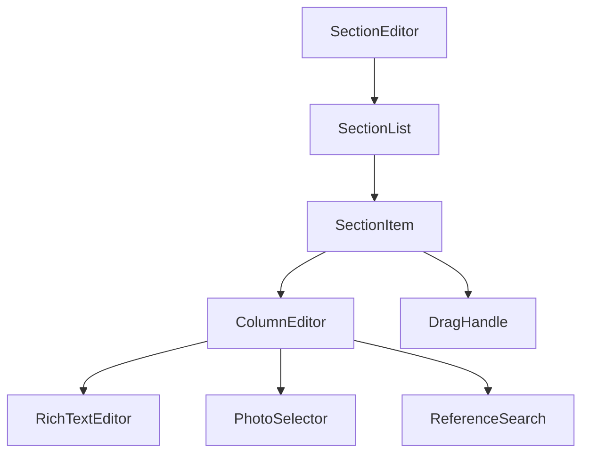
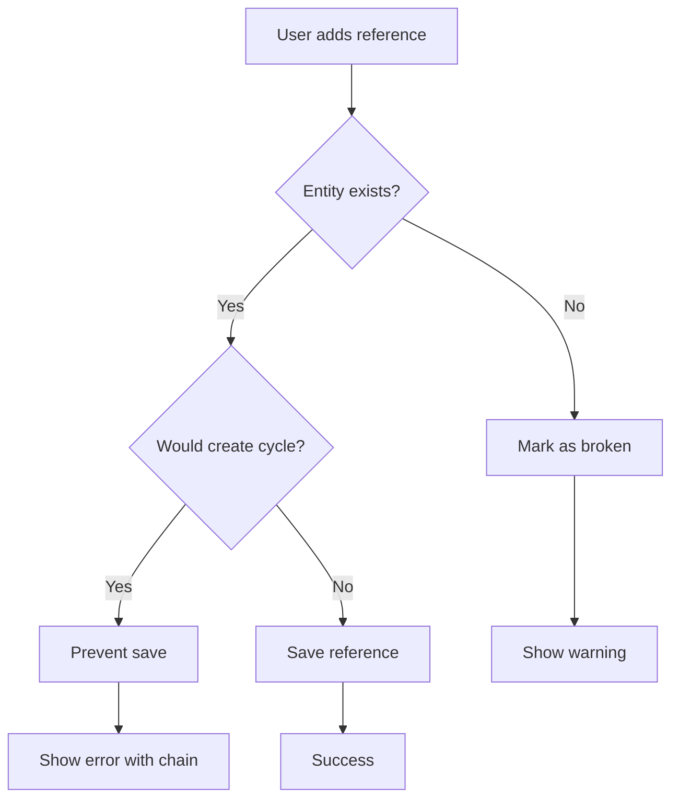
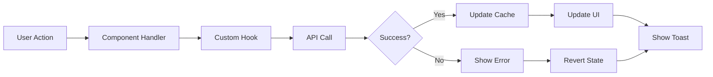

# Design Document

## Overview

This design document specifies the frontend-backend integration and Content Management System (CMS) implementation for the destination wedding platform's admin interface. The system will wire up 17 existing backend services to the admin UI while introducing modern UI patterns and comprehensive content management capabilities.

**Key Design Principles:**
1. **Leverage Existing Services**: All backend services are already implemented - focus on UI integration
2. **Modern UI Patterns**: Replace FormModal popups with collapsible inline forms or tabbed interfaces
3. **Grouped Navigation**: Reorganize sidebar with logical grouping for better discoverability
4. **Consistent Architecture**: Follow established Result<T> pattern and service layer conventions
5. **Accessibility First**: Maintain WCAG 2.1 AA compliance throughout

**Scope:**
- Frontend components for CMS functionality (content pages, section editor, home page editor)
- UI integration for existing backend services (photos, transportation, vendors, audit logs, RSVP analytics)
- Reference lookup system with searchable dropdowns
- Collapsible forms pattern replacing FormModal popups
- Grouped navigation sidebar
- API route integration for all CRUD operations

## Architecture

### High-Level Architecture

```
┌─────────────────────────────────────────────────────────────┐
│                     Admin UI Layer                          │
│  ┌──────────────┐  ┌──────────────┐  ┌──────────────┐     │
│  │   Pages      │  │  Components  │  │    Hooks     │     │
│  │ (Next.js)    │  │   (React)    │  │  (State)     │     │
│  └──────────────┘  └──────────────┘  └──────────────┘     │
└─────────────────────────────────────────────────────────────┘
                            │
                            ▼
┌─────────────────────────────────────────────────────────────┐
│                    API Routes Layer                         │
│  ┌──────────────────────────────────────────────────────┐  │
│  │  /api/admin/* endpoints (Authentication + Routing)   │  │
│  └──────────────────────────────────────────────────────┘  │
└─────────────────────────────────────────────────────────────┘
                            │
                            ▼
┌─────────────────────────────────────────────────────────────┐
│                   Service Layer (Existing)                  │
│  ┌──────────┐  ┌──────────┐  ┌──────────┐  ┌──────────┐  │
│  │  Guest   │  │  Event   │  │  Photo   │  │  Content │  │
│  │ Service  │  │ Service  │  │ Service  │  │ Service  │  │
│  └──────────┘  └──────────┘  └──────────┘  └──────────┘  │
│  └─────────────── 17 Services Total ──────────────────┘   │
└─────────────────────────────────────────────────────────────┘
                            │
                            ▼
┌─────────────────────────────────────────────────────────────┐
│                    Data Layer                               │
│  ┌──────────────────────────────────────────────────────┐  │
│  │         Supabase PostgreSQL + RLS                    │  │
│  └──────────────────────────────────────────────────────┘  │
└─────────────────────────────────────────────────────────────┘
```


### Component Architecture

The admin interface follows a layered component architecture:

**1. Page Components** (`app/admin/*/page.tsx`)
- Server Components by default for initial data loading
- Client Components when hooks or interactivity needed
- Handle routing, layout, and data fetching orchestration
- Delegate business logic to hooks and services

**2. Feature Components** (`components/admin/*`)
- Domain-specific components (GuestManager, ActivityManager, etc.)
- Encapsulate feature-specific UI and logic
- Reusable across multiple pages
- Examples: SectionEditor, ReferenceSearch, CollapsibleForm

**3. UI Components** (`components/ui/*`)
- Generic, reusable components
- Already implemented: DataTable, Button, FormModal, ConfirmDialog, Toast
- New components needed: CollapsibleForm, GroupedNavigation, ReferenceDropdown

**4. Custom Hooks** (`hooks/*`)
- State management and data fetching
- Follow naming convention: `use[Entity]` (e.g., useGuests, useActivities)
- Return interface with: `{ data, loading, error, refetch }`
- Use React Query or SWR for caching and revalidation

### Data Flow Pattern

```
User Action → Component Event Handler → API Route → Service Layer → Database
                                                                        │
User Feedback ← Component State Update ← Hook Update ← API Response ←─┘
```

**Example: Creating a Content Page**

1. User fills out collapsible form and clicks "Create"
2. Component calls `handleSubmit` with form data
3. Handler calls `POST /api/admin/content-pages` with validated data
4. API route authenticates, validates, calls `contentService.create()`
5. Service validates with Zod, sanitizes input, inserts to database
6. Service returns `Result<ContentPage>`
7. API route returns JSON response with appropriate status code
8. Hook updates local state with new data
9. Component displays success toast and refreshes list
10. Form collapses and clears


## Components and Interfaces

### 1. Section Editor Component

**Purpose**: Rich text editor for managing page sections with two-column layouts, photos, and reference links.

**Component Structure**:
```typescript
interface SectionEditorProps {
  pageType: 'activity' | 'event' | 'accommodation' | 'room_type' | 'custom' | 'home';
  pageId: string;
  onSave?: () => void;
}

// Note: The 'home' pageType enables section editing for the homepage
// Home page sections work identically to other page types with flexible layouts

interface Section {
  id: string;
  displayOrder: number;
  layout: 'one-column' | 'two-column'; // Layout configuration
  columns: Column[];
}

interface Column {
  id: string;
  columnNumber: 1 | 2;
  contentType: 'rich_text' | 'photos' | 'references';
  contentData: RichTextContent | PhotoContent | ReferenceContent;
}

interface ReferenceContent {
  references: Reference[];
}

interface Reference {
  id: string;
  type: 'event' | 'activity' | 'accommodation' | 'room_type' | 'content_page';
  name: string;
  slug?: string;
}
```

**Features**:
- Drag-and-drop section reordering
- **Flexible layout**: Choose one-column or two-column layout per section
- Rich text editing with BlockNote or similar
- Photo gallery integration
- Reference lookup with searchable dropdown
- Broken reference detection and warnings
- Circular reference prevention
- **Guest preview mode**: "Preview as Guest" button renders content exactly as guests will see it

**UI Layout**:
```
┌─────────────────────────────────────────────────────────┐
│  Section Editor: [Page Name]                           │
├─────────────────────────────────────────────────────────┤
│  [+ Add Section]  [Preview as Guest]  [Save All]       │
├─────────────────────────────────────────────────────────┤
│  ┌─────────────────────────────────────────────────┐   │
│  │ Section 1  [1 Col] [2 Col]  [↑] [↓] [Delete]   │   │
│  ├──────────────────┬──────────────────────────────┤   │
│  │  Column 1        │  Column 2                    │   │
│  │  [Rich Text]     │  [Photos]                    │   │
│  │  Content here... │  [Photo Grid]                │   │
│  └──────────────────┴──────────────────────────────┘   │
│  ┌─────────────────────────────────────────────────┐   │
│  │ Section 2  [1 Col] [2 Col]  [↑] [↓] [Delete]   │   │
│  ├─────────────────────────────────────────────────┤   │
│  │  Full Width Column                              │   │
│  │  [Rich Text spanning full width]                │   │
│  │  Content here...                                │   │
│  └─────────────────────────────────────────────────┘   │
│  ┌─────────────────────────────────────────────────┐   │
│  │ Section 3  [1 Col] [2 Col]  [↑] [↓] [Delete]   │   │
│  ├──────────────────┬──────────────────────────────┤   │
│  │  Column 1        │  Column 2                    │   │
│  │  [References]    │  [Rich Text]                 │   │
│  │  → Event: Ceremony                              │   │
│  │  → Activity: Beach Day                          │   │
│  └──────────────────┴──────────────────────────────┘   │
└─────────────────────────────────────────────────────────┘
```

**State Management**:
- Local state for sections array
- Each section has a `layout` field: 'one-column' or 'two-column'
- One-column layout: Only column 1 is used, spans full width
- Two-column layout: Both columns are used, split 50/50
- Layout toggle buttons allow switching between layouts
- Optimistic updates for reordering
- Debounced auto-save for content changes
- Validation before save
- Error handling for broken/circular references


### 2. Reference Lookup Component

**Purpose**: Searchable dropdown for selecting entities to reference in content.

**Component Structure**:
```typescript
interface ReferenceLookupProps {
  entityTypes: Array<'event' | 'activity' | 'accommodation' | 'room_type' | 'content_page'>;
  onSelect: (reference: Reference) => void;
  placeholder?: string;
  excludeIds?: string[]; // Prevent circular references
}

interface SearchResult {
  id: string;
  name: string;
  type: string;
  slug?: string;
  status?: string;
  preview?: string;
}
```

**Features**:
- Debounced search (300ms)
- Multi-entity type search
- Keyboard navigation (arrow keys, enter, escape)
- Result highlighting
- Entity type badges
- Preview on hover
- Accessibility (ARIA labels, screen reader support)

**UI Layout**:
```
┌─────────────────────────────────────────────────────┐
│  Search for events, activities, pages...           │
│  [Search input field with icon]                    │
└─────────────────────────────────────────────────────┘
         │
         ▼ (when typing)
┌─────────────────────────────────────────────────────┐
│  Search Results (12)                                │
├─────────────────────────────────────────────────────┤
│  [EVENT] Ceremony on the Beach                      │
│  → June 15, 2025 • Active                          │
├─────────────────────────────────────────────────────┤
│  [ACTIVITY] Welcome Dinner                          │
│  → June 14, 2025 • 45/50 capacity                  │
├─────────────────────────────────────────────────────┤
│  [PAGE] Accommodation Details                       │
│  → Published • /accommodation                       │
└─────────────────────────────────────────────────────┘
```

**API Integration**:
- `GET /api/admin/references/search?q={query}&type={type}`
- Returns max 20 results per entity type
- Ordered by relevance (exact match first, then partial)


### 3. Collapsible Form Component

**Purpose**: Replace FormModal popup pattern with inline collapsible forms for better UX.

**Component Structure**:
```typescript
interface CollapsibleFormProps<T> {
  title: string;
  fields: FormField[];
  schema: z.ZodSchema<T>;
  onSubmit: (data: T) => Promise<void>;
  onCancel?: () => void;
  initialData?: Partial<T>;
  isOpen: boolean;
  onToggle: () => void;
}
```

**Features**:
- Smooth expand/collapse animation
- Form validation with Zod
- Field-level error display
- Unsaved changes warning
- Auto-scroll to form on expand
- Auto-scroll to new item after creation
- Clear fields after successful submission

**UI Layout**:
```
┌─────────────────────────────────────────────────────┐
│  [+ Add New Event] ▼                                │
└─────────────────────────────────────────────────────┘
         │ (when expanded)
         ▼
┌─────────────────────────────────────────────────────┐
│  Add New Event                          [Cancel] ▲  │
├─────────────────────────────────────────────────────┤
│  Event Name *                                       │
│  [Input field]                                      │
│                                                     │
│  Date *                                             │
│  [Date picker]                                      │
│                                                     │
│  Location                                           │
│  [Location dropdown with hierarchy]                │
│                                                     │
│  Description                                        │
│  [Textarea]                                         │
│                                                     │
│  [Create Event]  [Cancel]                          │
└─────────────────────────────────────────────────────┘
```

**State Management**:
- Local form state with React Hook Form
- Validation on blur and submit
- Dirty state tracking for unsaved changes warning
- Loading state during submission

**Alternative: Tabbed Interface**

For pages with complex forms, use tabbed interface instead:

```
┌─────────────────────────────────────────────────────┐
│  [List] [Add New] [Import]                         │
└─────────────────────────────────────────────────────┘
         │ (when "Add New" clicked)
         ▼
┌─────────────────────────────────────────────────────┐
│  [List] [Add New*] [Import]                        │
├─────────────────────────────────────────────────────┤
│  Add New Event                                      │
│  ┌─────────────────────────────────────────────┐   │
│  │  Basic Info  │  Location  │  Advanced       │   │
│  ├─────────────────────────────────────────────┤   │
│  │  [Form fields for selected tab]             │   │
│  │                                              │   │
│  │  [Create]  [Cancel]                         │   │
│  └─────────────────────────────────────────────┘   │
└─────────────────────────────────────────────────────┘
```


### 4. Grouped Navigation Sidebar

**Purpose**: Organize admin sections into logical groups for better discoverability.

**Component Structure**:
```typescript
interface NavigationGroup {
  id: string;
  label: string;
  icon: string;
  items: NavigationItem[];
  badge?: number; // For pending counts
}

interface NavigationItem {
  id: string;
  label: string;
  href: string;
  badge?: number;
}
```

**Navigation Groups**:

1. **Guest Management** 👥
   - Guests
   - Groups
   - RSVPs

2. **Event Planning** 📅
   - Events
   - Activities
   - Locations

3. **Logistics** 🚗
   - Accommodations
   - Room Types
   - Transportation
   - Vendors

4. **Content** 📝
   - Content Pages
   - Home Page
   - Photos

5. **Communication** ✉️
   - Emails
   - Notifications

6. **Financial** 💰
   - Budget
   - Vendor Payments

7. **System** ⚙️
   - Settings
   - Audit Logs
   - User Management

**UI Layout**:
```
┌─────────────────────────────┐
│  🌴 Admin          [←]      │
├─────────────────────────────┤
│  🏠 Dashboard               │
├─────────────────────────────┤
│  👥 Guest Management    ▼   │
│    • Guests                 │
│    • Groups                 │
│    • RSVPs                  │
├─────────────────────────────┤
│  📅 Event Planning      ▶   │
├─────────────────────────────┤
│  🚗 Logistics           ▶   │
├─────────────────────────────┤
│  📝 Content             ▶   │
│                         (3) │ ← Badge for pending photos
├─────────────────────────────┤
│  ✉️ Communication       ▶   │
├─────────────────────────────┤
│  💰 Financial           ▶   │
├─────────────────────────────┤
│  ⚙️ System              ▶   │
└─────────────────────────────┘
```

**Features**:
- Expand/collapse groups
- Persist expansion state in localStorage
- Highlight active group and item
- Badge support for pending items
- Keyboard navigation
- Mobile responsive (drawer on mobile)
- Quick access section for frequently used pages

**State Management**:
- Local state for expanded groups
- Persist to localStorage: `admin_nav_expanded_groups`
- Sync across tabs with storage events


### 5. Content Page Management

**Purpose**: CRUD interface for custom content pages.

**Component Structure**:
```typescript
interface ContentPage {
  id: string;
  slug: string;
  title: string;
  status: 'draft' | 'published';
  createdAt: string;
  updatedAt: string;
}
```

**Page Layout**:
```
┌─────────────────────────────────────────────────────┐
│  Content Pages                                      │
│  [+ Add Page]  [Search...]                         │
├─────────────────────────────────────────────────────┤
│  Title              Slug            Status  Actions │
├─────────────────────────────────────────────────────┤
│  Our Story          /our-story      🟢 Pub  [Edit]  │
│                                             [Sections]│
│                                             [Delete] │
├─────────────────────────────────────────────────────┤
│  Travel Info        /travel-info    🟡 Draft [Edit] │
│                                             [Sections]│
│                                             [Delete] │
└─────────────────────────────────────────────────────┘
```

**Features**:
- List view with DataTable
- Collapsible "Add Page" form
- Inline edit (opens collapsible form with data)
- "Manage Sections" button opens Section Editor
- Slug auto-generation from title
- Slug conflict detection
- Status toggle (draft/published)
- Delete confirmation dialog
- "View Page" link to guest-facing page

**API Integration**:
- `GET /api/admin/content-pages` - List all pages
- `POST /api/admin/content-pages` - Create page
- `PUT /api/admin/content-pages/:id` - Update page
- `DELETE /api/admin/content-pages/:id` - Delete page
- `GET /api/admin/content-pages/:id/sections` - Get sections for page


### 6. Home Page Editor

**Purpose**: Customize wedding homepage content.

**Component Structure**:
```typescript
interface HomePageConfig {
  title: string;
  subtitle: string;
  welcomeMessage: string; // Rich text
  heroImageUrl: string;
}
```

**Page Layout**:
```
┌─────────────────────────────────────────────────────┐
│  Home Page Editor                                   │
├─────────────────────────────────────────────────────┤
│  Wedding Title *                                    │
│  [Input: "Sarah & Michael's Costa Rica Wedding"]   │
│                                                     │
│  Subtitle                                           │
│  [Input: "June 14-16, 2025 • Tamarindo"]          │
│                                                     │
│  Hero Image URL                                     │
│  [Input: https://...]                              │
│  [Preview thumbnail]                                │
│                                                     │
│  Welcome Message                                    │
│  [Rich text editor]                                │
│                                                     │
│  [Manage Sections]  [Save Changes]  [Preview]     │
└─────────────────────────────────────────────────────┘
```

**Features**:
- Form with rich text editor for welcome message
- Image URL validation and preview
- **"Manage Sections" button opens Section Editor for homepage** (pageType='home')
- Section Editor supports 1-column and 2-column layouts for homepage sections
- **"Preview" button opens guest-facing homepage in new tab** - shows exactly what guests will see
- Auto-save draft every 30 seconds
- Validation before save

**API Integration**:
- `GET /api/admin/home-page` - Get current config
- `PUT /api/admin/home-page` - Update config
- `GET /api/admin/home-page/sections` - Get homepage sections


### 7. Location Hierarchy Management

**Purpose**: Manage hierarchical location structure (Country → Region → City → Venue).

**Component Structure**:
```typescript
interface Location {
  id: string;
  name: string;
  address?: string;
  description?: string;
  parentLocationId?: string;
  children?: Location[];
}
```

**Page Layout**:
```
┌─────────────────────────────────────────────────────┐
│  Locations                                          │
│  [+ Add Location]  [Search...]                     │
├─────────────────────────────────────────────────────┤
│  📍 Costa Rica                                      │
│    📍 Guanacaste Province                           │
│      📍 Tamarindo                                   │
│        🏨 Tamarindo Diria Beach Resort              │
│        🏖️ Playa Tamarindo                           │
│    📍 San José                                      │
│      ✈️ Juan Santamaría International Airport       │
└─────────────────────────────────────────────────────┘
```

**Features**:
- Tree view with expand/collapse
- Drag-and-drop to change parent
- Circular reference prevention
- Collapsible "Add Location" form with parent selector
- Inline edit
- Delete with cascade warning (children become orphans)
- Search across all levels
- Icon indicators for location types

**API Integration**:
- `GET /api/admin/locations` - Get all locations (tree structure)
- `POST /api/admin/locations` - Create location
- `PUT /api/admin/locations/:id` - Update location
- `DELETE /api/admin/locations/:id` - Delete location
- `POST /api/admin/locations/:id/validate-parent` - Check for circular references


### 8. Room Types Management

**Purpose**: Manage room types within accommodations.

**Component Structure**:
```typescript
interface RoomType {
  id: string;
  accommodationId: string;
  name: string;
  capacity: number;
  pricePerNight: number;
  description?: string;
  checkInDate: string;
  checkOutDate: string;
}
```

**Page Layout** (accessed from Accommodations page):
```
┌─────────────────────────────────────────────────────┐
│  Room Types: Tamarindo Diria Beach Resort           │
│  [+ Add Room Type]  [Back to Accommodations]       │
├─────────────────────────────────────────────────────┤
│  Name           Capacity  Price/Night  Occupancy   │
├─────────────────────────────────────────────────────┤
│  Ocean View     2         $150         2/2 (100%)  │
│  Suite          4         $250         3/4 (75%)   │
│  Standard       2         $100         0/2 (0%)    │
└─────────────────────────────────────────────────────┘
```

**Features**:
- Nested under Accommodations
- Collapsible "Add Room Type" form
- Capacity tracking with visual indicators
- Guest assignment interface
- "Manage Sections" button for room type content
- Price and date management
- Occupancy percentage display

**API Integration**:
- `GET /api/admin/accommodations/:id/room-types` - List room types
- `POST /api/admin/room-types` - Create room type
- `PUT /api/admin/room-types/:id` - Update room type
- `DELETE /api/admin/room-types/:id` - Delete room type
- `GET /api/admin/room-types/:id/sections` - Get sections


### 9. Transportation Management

**Purpose**: View and manage transportation manifests for guest arrivals and departures.

**Component Structure**:
```typescript
interface TransportationManifest {
  date: string;
  airport: 'SJO' | 'LIR' | 'Other';
  guests: ManifestGuest[];
  vehicleRequirements: VehicleRequirement[];
}

interface ManifestGuest {
  id: string;
  name: string;
  flightNumber: string;
  time: string;
  shuttleAssignment?: string;
}

interface VehicleRequirement {
  vehicleType: string;
  count: number;
  cost: number;
}
```

**Page Layout**:
```
┌─────────────────────────────────────────────────────┐
│  Transportation Management                          │
│  [Arrivals] [Departures]                           │
├─────────────────────────────────────────────────────┤
│  Date: [June 14, 2025 ▼]  Airport: [All ▼]        │
├─────────────────────────────────────────────────────┤
│  Morning (6:00 AM - 12:00 PM) - 8 guests           │
│  ┌─────────────────────────────────────────────┐   │
│  │ Guest Name    Flight    Time    Shuttle     │   │
│  │ John Doe      AA123     8:30    Van 1       │   │
│  │ Jane Smith    UA456     9:15    Van 1       │   │
│  └─────────────────────────────────────────────┘   │
│                                                     │
│  Afternoon (12:00 PM - 6:00 PM) - 12 guests        │
│  ┌─────────────────────────────────────────────┐   │
│  │ Guest Name    Flight    Time    Shuttle     │   │
│  │ ...                                          │   │
│  └─────────────────────────────────────────────┘   │
│                                                     │
│  Vehicle Requirements:                              │
│  • 2 Vans (12 passengers each) - $200              │
│  • 1 SUV (6 passengers) - $100                     │
│  Total Cost: $500                                   │
│                                                     │
│  [Generate Driver Sheets]  [Print Manifest]       │
└─────────────────────────────────────────────────────┘
```

**Features**:
- Tab interface for Arrivals/Departures
- Date and airport filters
- Time window grouping (Morning, Afternoon, Evening)
- Shuttle assignment interface
- Vehicle requirement calculations
- Driver sheet generation (printable PDF)
- Manifest printing
- Real-time cost calculations

**API Integration**:
- `GET /api/admin/transportation/arrivals?date={date}&airport={airport}` - Get arrival manifest
- `GET /api/admin/transportation/departures?date={date}&airport={airport}` - Get departure manifest
- `POST /api/admin/transportation/assign-shuttle` - Assign guest to shuttle
- `GET /api/admin/transportation/driver-sheets?date={date}` - Generate driver sheets


### 10. Audit Logs Management

**Purpose**: View and search system audit logs for accountability.

**Component Structure**:
```typescript
interface AuditLog {
  id: string;
  timestamp: string;
  userId: string;
  userName: string;
  action: 'create' | 'update' | 'delete' | 'login' | 'logout';
  entityType: string;
  entityId: string;
  description: string;
  metadata?: Record<string, any>;
}
```

**Page Layout**:
```
┌─────────────────────────────────────────────────────┐
│  Audit Logs                                         │
│  [Search...]  [User ▼]  [Action ▼]  [Entity ▼]    │
│  [Date Range: Last 7 days ▼]  [Export CSV]        │
├─────────────────────────────────────────────────────┤
│  Time         User      Action   Entity    Details │
├─────────────────────────────────────────────────────┤
│  2:30 PM      Admin     UPDATE   Guest     Updated │
│  Jan 25       Sarah              John Doe   email  │
├─────────────────────────────────────────────────────┤
│  2:15 PM      Admin     CREATE   Event     Created │
│  Jan 25       Michael            Ceremony   event  │
├─────────────────────────────────────────────────────┤
│  1:45 PM      Admin     DELETE   Vendor    Deleted │
│  Jan 25       Sarah              Florist    vendor │
│               ⚠️ Critical Action                    │
└─────────────────────────────────────────────────────┘
```

**Features**:
- Read-only interface (no editing/deletion)
- Advanced filtering (user, action, entity type, date range)
- Search by description
- Highlight critical actions (delete, permission changes)
- Entity links (click to view entity)
- CSV export
- Pagination (50 logs per page)
- Real-time updates for new logs

**API Integration**:
- `GET /api/admin/audit-logs?user={user}&action={action}&entity={entity}&from={date}&to={date}` - List logs
- `GET /api/admin/audit-logs/export` - Export to CSV


### 11. RSVP Analytics Dashboard

**Purpose**: View RSVP analytics and trends for planning.

**Component Structure**:
```typescript
interface RSVPAnalytics {
  overallResponseRate: number;
  responseCounts: {
    attending: number;
    declined: number;
    maybe: number;
    pending: number;
  };
  eventResponseRates: EventResponseRate[];
  activityResponseRates: ActivityResponseRate[];
  responseTrends: ResponseTrend[];
  capacityUtilization: CapacityUtilization[];
  pendingReminders: number;
}
```

**Page Layout**:
```
┌─────────────────────────────────────────────────────┐
│  RSVP Analytics Dashboard                           │
├─────────────────────────────────────────────────────┤
│  Overall Response Rate: 78%                         │
│  ┌─────────────────────────────────────────────┐   │
│  │  🟢 Attending: 45  🔴 Declined: 8           │   │
│  │  🟡 Maybe: 5       ⚪ Pending: 12           │   │
│  └─────────────────────────────────────────────┘   │
├─────────────────────────────────────────────────────┤
│  Response Rate by Event                             │
│  ┌─────────────────────────────────────────────┐   │
│  │  Ceremony        ████████████░░ 85%         │   │
│  │  Reception       ██████████░░░░ 72%         │   │
│  │  Welcome Dinner  ███████░░░░░░░ 65%         │   │
│  └─────────────────────────────────────────────┘   │
├─────────────────────────────────────────────────────┤
│  Capacity Utilization (Activities)                  │
│  ┌─────────────────────────────────────────────┐   │
│  │  Beach Day       ████████████░░ 45/50 ⚠️    │   │
│  │  Zip Line        ██████████████ 20/20 🔴    │   │
│  │  Sunset Cruise   ████████░░░░░░ 28/40       │   │
│  └─────────────────────────────────────────────┘   │
├─────────────────────────────────────────────────────┤
│  Response Trends (Last 30 Days)                     │
│  [Line chart showing RSVPs over time]              │
├─────────────────────────────────────────────────────┤
│  Pending Reminders: 12 guests past deadline        │
│  [Send Reminder Emails]                            │
└─────────────────────────────────────────────────────┘
```

**Features**:
- Real-time metrics
- Visual progress bars
- Capacity warnings (90%+ = orange, 100% = red)
- Response trend chart (Chart.js or Recharts)
- Filter by guest type
- Date range filter for trends
- "Send Reminder" quick action
- Export analytics to PDF

**API Integration**:
- `GET /api/admin/rsvp-analytics` - Get all analytics
- `GET /api/admin/rsvp-analytics/trends?from={date}&to={date}` - Get trends
- `POST /api/admin/rsvp-analytics/send-reminders` - Send reminder emails


## Data Models

### CMS Data Models

**Content Pages**:
```typescript
interface ContentPage {
  id: string;
  slug: string;
  title: string;
  status: 'draft' | 'published';
  createdAt: string;
  updatedAt: string;
}
```

**Sections**:
```typescript
interface Section {
  id: string;
  pageType: 'activity' | 'event' | 'accommodation' | 'room_type' | 'custom' | 'home';
  pageId: string;
  displayOrder: number;
  layout: 'one-column' | 'two-column'; // Layout configuration
  createdAt: string;
  updatedAt: string;
}
```

**Columns**:
```typescript
interface Column {
  id: string;
  sectionId: string;
  columnNumber: 1 | 2;
  contentType: 'rich_text' | 'photos' | 'references';
  contentData: RichTextContent | PhotoContent | ReferenceContent;
  createdAt: string;
  updatedAt: string;
}

interface RichTextContent {
  html: string;
}

interface PhotoContent {
  photoIds: string[];
}

interface ReferenceContent {
  references: Reference[];
}

interface Reference {
  id: string;
  type: 'event' | 'activity' | 'accommodation' | 'room_type' | 'content_page';
  name: string;
  slug?: string;
}
```

**Content Versions**:
```typescript
interface ContentVersion {
  id: string;
  pageType: string;
  pageId: string;
  createdBy: string | null;
  sectionsSnapshot: Array<Section & { columns: Column[] }>;
  createdAt: string;
}
```

### Location Data Model

```typescript
interface Location {
  id: string;
  name: string;
  address?: string;
  description?: string;
  parentLocationId?: string;
  createdAt: string;
  updatedAt: string;
}
```

### Home Page Data Model

```typescript
interface HomePageConfig {
  id: string;
  title: string;
  subtitle: string;
  welcomeMessage: string; // Rich text HTML
  heroImageUrl: string;
  updatedAt: string;
}
```


## Correctness Properties

A property is a characteristic or behavior that should hold true across all valid executions of a system—essentially, a formal statement about what the system should do. Properties serve as the bridge between human-readable specifications and machine-verifiable correctness guarantees.

### Property 1: Unique Slug Generation

*For any* valid content page data, when creating a page, the generated slug SHALL be unique across all existing pages.

**Validates: Requirements 1.1**

### Property 2: Slug Preservation on Update

*For any* content page, when updating the page without explicitly changing the slug field, the slug SHALL remain unchanged.

**Validates: Requirements 1.2**

### Property 3: Cascade Deletion of Sections

*For any* content page with associated sections, when deleting the page, all associated sections and their columns SHALL also be deleted.

**Validates: Requirements 1.3**

### Property 4: Section Display Order

*For any* set of sections belonging to a page, when retrieving sections, they SHALL be returned sorted by display_order in ascending order.

**Validates: Requirements 2.1**

### Property 5: Reference Entity Validation

*For any* reference selection, the system SHALL verify that the referenced entity exists in the database before allowing the reference to be saved.

**Validates: Requirements 2.9**

### Property 6: Broken Reference Detection

*For any* reference pointing to a non-existent entity, the system SHALL mark it as broken and include it in the broken references list.

**Validates: Requirements 2.10**

### Property 7: Circular Reference Prevention

*For any* reference chain that would create a cycle (A → B → C → A), the system SHALL detect the cycle and prevent the save operation.

**Validates: Requirements 2.11, 4.3, 19.5**

### Property 8: Event Scheduling Conflict Detection

*For any* two events at the same location with overlapping time ranges, the system SHALL detect the conflict and prevent creation of the second event.

**Validates: Requirements 6.3**

### Property 9: Activity Capacity Warning Threshold

*For any* activity where current attendees / capacity >= 0.9, the system SHALL display a near-capacity warning.

**Validates: Requirements 7.7**

### Property 10: Activity Capacity Alert Threshold

*For any* activity where current attendees / capacity >= 1.0, the system SHALL display an at-capacity alert.

**Validates: Requirements 7.8**

### Property 11: CSV Field Escaping

*For any* string containing commas, quotes, or newlines, the CSV formatter SHALL properly escape the string by wrapping in quotes and doubling internal quotes.

**Validates: Requirements 9.2**

### Property 12: Guest CSV Round-Trip

*For any* valid guest data, exporting to CSV then importing SHALL produce guest records equivalent to the original data.

**Validates: Requirements 9.9**

### Property 13: Validation Error Response

*For any* invalid input data sent to an API endpoint, the system SHALL return HTTP 400 with a VALIDATION_ERROR code and details about which fields failed validation.

**Validates: Requirements 13.6**

### Property 14: Rich Text Sanitization

*For any* section with rich text content, when saving, the system SHALL sanitize the HTML to allow only safe tags (p, br, strong, em, u, a, ul, ol, li) and remove all others.

**Validates: Requirements 15.1, 19.3**

### Property 15: Reference Validation API

*For any* set of references submitted for validation, the API SHALL check each reference and return a list of broken references (those pointing to non-existent entities).

**Validates: Requirements 15.6**

### Property 16: Circular Reference Detection API

*For any* reference graph containing a cycle, the circular reference detection API SHALL return true indicating a cycle was found.

**Validates: Requirements 15.7**

### Property 17: Search Result Relevance Ordering

*For any* search query, results SHALL be ordered with exact matches first, followed by partial matches, sorted alphabetically within each group.

**Validates: Requirements 16.7**

### Property 18: Plain Text Sanitization

*For any* string containing HTML tags submitted as plain text input, the sanitization SHALL remove all HTML tags, leaving only the text content.

**Validates: Requirements 19.2**

### Property 19: Slug Auto-Generation

*For any* title string, the auto-generated slug SHALL be lowercase, have spaces replaced with hyphens, and have all special characters removed.

**Validates: Requirements 31.1, 31.5**

### Property 20: Slug Conflict Resolution

*For any* slug that conflicts with an existing slug, the system SHALL append a number (starting with -2) to make it unique.

**Validates: Requirements 31.3**


## Error Handling

### Error Handling Strategy

The system follows a consistent error handling pattern across all layers:

**1. Service Layer** (Already Implemented)
- All services return `Result<T>` type
- Never throw errors - always return error objects
- Standard error codes: `VALIDATION_ERROR`, `DATABASE_ERROR`, `NOT_FOUND`, `CONFLICT`, `UNAUTHORIZED`
- Include details for debugging

**2. API Layer**
- Map service error codes to HTTP status codes
- Return consistent JSON error format
- Log all errors server-side
- Never expose sensitive information in error messages

**3. UI Layer**
- Display user-friendly error messages
- Show field-level validation errors
- Use toast notifications for operation feedback
- Provide actionable error messages

### Error Code Mapping

| Service Error Code | HTTP Status | User Message |
|-------------------|-------------|--------------|
| VALIDATION_ERROR | 400 | "Please check the highlighted fields" |
| DATABASE_ERROR | 500 | "Unable to save changes. Please try again." |
| NOT_FOUND | 404 | "The requested item was not found" |
| CONFLICT | 409 | "This conflicts with existing data" |
| UNAUTHORIZED | 401 | "Please log in to continue" |
| CIRCULAR_REFERENCE | 400 | "This would create a circular reference" |
| BROKEN_REFERENCE | 400 | "Some references point to deleted items" |

### Specific Error Scenarios

**Circular Reference Detection**:
```typescript
// Error response format
{
  success: false,
  error: {
    code: 'CIRCULAR_REFERENCE',
    message: 'Circular reference detected',
    details: {
      chain: ['Page A', 'Page B', 'Page C', 'Page A']
    }
  }
}
```

**Broken Reference Detection**:
```typescript
// Error response format
{
  success: false,
  error: {
    code: 'BROKEN_REFERENCE',
    message: 'Some references are broken',
    details: {
      brokenReferences: [
        { id: 'uuid', type: 'event', name: 'Deleted Event' }
      ]
    }
  }
}
```

**Scheduling Conflict**:
```typescript
// Error response format
{
  success: false,
  error: {
    code: 'SCHEDULING_CONFLICT',
    message: 'Event conflicts with existing event',
    details: {
      conflictingEvent: {
        id: 'uuid',
        name: 'Ceremony',
        startTime: '2025-06-15T14:00:00Z',
        endTime: '2025-06-15T15:00:00Z'
      }
    }
  }
}
```

### Error Boundaries

**Component-Level Error Boundaries**:
- Wrap each major feature component in ErrorBoundary
- Display fallback UI with error message
- Provide "Try Again" button
- Log errors to monitoring service

**Page-Level Error Boundaries**:
- Catch unhandled errors at page level
- Display friendly error page
- Provide navigation back to dashboard
- Log errors with full context


## Testing Strategy

### Dual Testing Approach

The system requires both unit testing and property-based testing for comprehensive coverage:

**Unit Tests**: Verify specific examples, edge cases, and error conditions
**Property Tests**: Verify universal properties across all inputs

Together, these provide comprehensive coverage where unit tests catch concrete bugs and property tests verify general correctness.

### Property-Based Testing Configuration

**Library**: fast-check (already in use)
**Configuration**: Minimum 100 iterations per property test
**Tagging**: Each test must reference its design document property

Tag format: `Feature: admin-backend-integration-cms, Property {number}: {property_text}`

Example:
```typescript
describe('Feature: admin-backend-integration-cms, Property 12: Guest CSV Round-Trip', () => {
  it('should preserve data through export and import', () => {
    fc.assert(fc.property(guestArbitrary, async (guest) => {
      const exportResult = await guestService.exportToCSV([guest]);
      expect(exportResult.success).toBe(true);
      if (!exportResult.success) return;
      
      const importResult = await guestService.importFromCSV(exportResult.data);
      expect(importResult.success).toBe(true);
      if (!importResult.success) return;
      
      expect(importResult.data[0]).toEqual(guest);
    }), { numRuns: 100 });
  });
});
```

### Test Coverage Requirements

- **Service Layer**: 90%+ coverage
- **API Routes**: 85%+ coverage
- **Components**: 70%+ coverage
- **Critical Paths**: 100% coverage (CMS operations, reference validation, circular detection)

### Unit Test Patterns

**Service Method Testing** (4 paths per method):
1. Success path - valid input returns success
2. Validation error - invalid input returns VALIDATION_ERROR
3. Database error - DB failure returns DATABASE_ERROR
4. Security - malicious input is sanitized

**API Route Testing**:
1. Authenticated request with valid data returns 201/200
2. Unauthenticated request returns 401
3. Invalid data returns 400 with validation details
4. Database error returns 500

**Component Testing**:
1. Renders correctly with valid props
2. Handles user interactions (clicks, form submissions)
3. Displays loading states
4. Displays error states
5. Calls callbacks with correct data

### Property Test Patterns

**Round-Trip Properties**:
```typescript
// CSV Export/Import
fc.property(fc.array(guestArbitrary), async (guests) => {
  const csv = await exportToCSV(guests);
  const imported = await importFromCSV(csv);
  return deepEqual(imported, guests);
});
```

**Invariant Properties**:
```typescript
// Slug uniqueness
fc.property(fc.array(contentPageArbitrary), async (pages) => {
  const slugs = pages.map(p => p.slug);
  const uniqueSlugs = new Set(slugs);
  return slugs.length === uniqueSlugs.size;
});
```

**Validation Properties**:
```typescript
// Circular reference detection
fc.property(circularReferenceGraphArbitrary, async (graph) => {
  const result = await detectCircularReferences(graph);
  return result === true; // Should always detect cycles
});
```

**Sanitization Properties**:
```typescript
// HTML sanitization
fc.property(maliciousHTMLArbitrary, (html) => {
  const sanitized = sanitizeRichText(html);
  return !sanitized.includes('<script>') && 
         !sanitized.includes('javascript:') &&
         !sanitized.includes('onerror=');
});
```

### Integration Testing

**API Integration Tests**:
- Test full request/response cycle
- Use test database with cleanup
- Test authentication flow
- Test error responses
- Test pagination and filtering

**Component Integration Tests**:
- Test component interactions
- Test data flow between components
- Test form submission flows
- Test navigation flows

### E2E Testing

**Critical User Flows**:
1. Create content page → Add sections → Publish → View as guest
2. Create event → Add to section → Verify reference → View on page
3. Import guests from CSV → Verify data → Export → Compare
4. Create location hierarchy → Prevent circular reference → Verify tree
5. Assign room types → Track capacity → Verify warnings

**Accessibility Testing**:
- Keyboard navigation through all forms
- Screen reader compatibility
- WCAG 2.1 AA compliance
- Focus management
- ARIA labels and roles


## API Integration Patterns

### RESTful API Design

All API endpoints follow RESTful conventions:

**Resource Naming**:
- Plural nouns for collections: `/api/admin/content-pages`
- Singular for specific resource: `/api/admin/content-pages/:id`
- Nested resources: `/api/admin/accommodations/:id/room-types`

**HTTP Methods**:
- `GET` - Retrieve resource(s)
- `POST` - Create new resource
- `PUT` - Update existing resource
- `DELETE` - Delete resource

**Response Format**:
```typescript
// Success response
{
  success: true,
  data: T
}

// Error response
{
  success: false,
  error: {
    code: string,
    message: string,
    details?: any
  }
}
```

### API Endpoint Specifications

**Content Pages**:
```
GET    /api/admin/content-pages              - List all pages
POST   /api/admin/content-pages              - Create page
GET    /api/admin/content-pages/:id          - Get page
PUT    /api/admin/content-pages/:id          - Update page
DELETE /api/admin/content-pages/:id          - Delete page
GET    /api/admin/content-pages/:id/sections - Get page sections
```

**Sections**:
```
GET    /api/admin/sections/:pageType/:pageId - List sections for page
POST   /api/admin/sections                   - Create section
PUT    /api/admin/sections/:id               - Update section
DELETE /api/admin/sections/:id               - Delete section
POST   /api/admin/sections/reorder           - Reorder sections
POST   /api/admin/sections/validate-refs     - Validate references
POST   /api/admin/sections/check-circular    - Check circular refs
```

**References**:
```
GET    /api/admin/references/search          - Search entities
  Query params: q (query), type (entity type)
GET    /api/admin/references/:type/:id       - Get entity preview
```

**Locations**:
```
GET    /api/admin/locations                  - Get location tree
POST   /api/admin/locations                  - Create location
PUT    /api/admin/locations/:id              - Update location
DELETE /api/admin/locations/:id              - Delete location
POST   /api/admin/locations/:id/validate-parent - Check circular refs
```

**Home Page**:
```
GET    /api/admin/home-page                  - Get config
PUT    /api/admin/home-page                  - Update config
GET    /api/admin/home-page/sections         - Get sections
```

**Room Types**:
```
GET    /api/admin/accommodations/:id/room-types - List room types
POST   /api/admin/room-types                    - Create room type
PUT    /api/admin/room-types/:id                - Update room type
DELETE /api/admin/room-types/:id                - Delete room type
GET    /api/admin/room-types/:id/sections       - Get sections
```

**Transportation**:
```
GET    /api/admin/transportation/arrivals    - Get arrival manifest
  Query params: date, airport
GET    /api/admin/transportation/departures  - Get departure manifest
  Query params: date, airport
POST   /api/admin/transportation/assign-shuttle - Assign shuttle
GET    /api/admin/transportation/driver-sheets  - Generate driver sheets
  Query params: date
```

**Audit Logs**:
```
GET    /api/admin/audit-logs                 - List logs
  Query params: user, action, entity, from, to, page, pageSize
GET    /api/admin/audit-logs/export          - Export to CSV
```

**RSVP Analytics**:
```
GET    /api/admin/rsvp-analytics             - Get all analytics
GET    /api/admin/rsvp-analytics/trends      - Get trends
  Query params: from, to
POST   /api/admin/rsvp-analytics/send-reminders - Send reminders
```

### Authentication Pattern

All API routes require authentication:

```typescript
// API route template
export async function GET(request: Request) {
  // 1. Authenticate
  const supabase = createRouteHandlerClient({ cookies });
  const { data: { session }, error } = await supabase.auth.getSession();
  
  if (error || !session) {
    return NextResponse.json(
      { success: false, error: { code: 'UNAUTHORIZED', message: 'Authentication required' } },
      { status: 401 }
    );
  }
  
  // 2. Call service
  const result = await service.method();
  
  // 3. Return response
  return NextResponse.json(result, { 
    status: result.success ? 200 : 500 
  });
}
```

### Pagination Pattern

List endpoints support pagination:

```typescript
// Query parameters
?page=1&pageSize=50

// Response format
{
  success: true,
  data: {
    items: T[],
    total: number,
    page: number,
    pageSize: number,
    totalPages: number
  }
}
```

### Filtering Pattern

List endpoints support filtering:

```typescript
// Query parameters
?filter_status=published&filter_type=event

// Multiple values
?filter_airport=SJO,LIR

// Date ranges
?from=2025-01-01&to=2025-12-31
```

### Search Pattern

Search endpoints use query parameter:

```typescript
// Query parameter
?q=ceremony

// Response includes relevance ordering
{
  success: true,
  data: {
    results: SearchResult[],
    total: number
  }
}
```


## State Management

### State Management Approach

The application uses a combination of state management strategies:

**1. Server State** (React Query / SWR)
- Data fetched from API
- Automatic caching and revalidation
- Background refetching
- Optimistic updates
- Error retry logic

**2. Local Component State** (useState)
- UI state (modals, dropdowns, forms)
- Temporary state (search queries, filters)
- Component-specific state

**3. Form State** (React Hook Form)
- Form field values
- Validation state
- Dirty state tracking
- Error messages

**4. Global UI State** (Context API)
- Toast notifications
- Theme preferences
- User session
- Navigation state

### Custom Hooks Pattern

All data fetching uses custom hooks following this pattern:

```typescript
interface UseEntityReturn<T> {
  data: T | null;
  loading: boolean;
  error: Error | null;
  refetch: () => Promise<void>;
  mutate: (data: T) => Promise<void>;
}

export function useEntity(id: string): UseEntityReturn<Entity> {
  const [data, setData] = useState<Entity | null>(null);
  const [loading, setLoading] = useState(true);
  const [error, setError] = useState<Error | null>(null);
  
  const fetchData = useCallback(async () => {
    setLoading(true);
    try {
      const response = await fetch(`/api/admin/entities/${id}`);
      const result = await response.json();
      
      if (result.success) {
        setData(result.data);
        setError(null);
      } else {
        setError(new Error(result.error.message));
      }
    } catch (err) {
      setError(err instanceof Error ? err : new Error('Unknown error'));
    } finally {
      setLoading(false);
    }
  }, [id]);
  
  useEffect(() => {
    fetchData();
  }, [fetchData]);
  
  const mutate = useCallback(async (newData: Entity) => {
    // Optimistic update
    setData(newData);
    
    try {
      const response = await fetch(`/api/admin/entities/${id}`, {
        method: 'PUT',
        headers: { 'Content-Type': 'application/json' },
        body: JSON.stringify(newData),
      });
      
      const result = await response.json();
      
      if (result.success) {
        setData(result.data);
      } else {
        // Revert on error
        await fetchData();
        throw new Error(result.error.message);
      }
    } catch (err) {
      // Revert on error
      await fetchData();
      throw err;
    }
  }, [id, fetchData]);
  
  return { data, loading, error, refetch: fetchData, mutate };
}
```

### Optimistic Updates

For better UX, use optimistic updates for mutations:

```typescript
const handleUpdate = async (newData: Entity) => {
  // 1. Update UI immediately
  setData(newData);
  
  // 2. Send request to server
  try {
    const result = await updateEntity(newData);
    if (!result.success) {
      // 3. Revert on error
      await refetch();
      showToast({ type: 'error', message: result.error.message });
    }
  } catch (error) {
    // 3. Revert on error
    await refetch();
    showToast({ type: 'error', message: 'Update failed' });
  }
};
```

### Real-Time Updates

Use Supabase real-time subscriptions for collaborative editing:

```typescript
useEffect(() => {
  const supabase = createClient(url, key);
  
  const channel = supabase
    .channel('content-pages-changes')
    .on('postgres_changes', {
      event: '*',
      schema: 'public',
      table: 'content_pages',
    }, (payload) => {
      // Show notification
      showToast({
        type: 'info',
        message: 'Content updated by another user',
      });
      
      // Refresh data
      refetch();
    })
    .subscribe();
  
  return () => {
    supabase.removeChannel(channel);
  };
}, [refetch]);
```

### Cache Invalidation

Invalidate cache after mutations:

```typescript
const handleCreate = async (data: CreateDTO) => {
  const result = await createEntity(data);
  
  if (result.success) {
    // Invalidate list cache
    await refetchList();
    
    // Show success message
    showToast({ type: 'success', message: 'Created successfully' });
  }
};
```

### Form State Management

Use React Hook Form for complex forms:

```typescript
const { register, handleSubmit, formState: { errors, isDirty } } = useForm({
  resolver: zodResolver(schema),
  defaultValues: initialData,
});

const onSubmit = handleSubmit(async (data) => {
  const result = await createEntity(data);
  
  if (result.success) {
    reset(); // Clear form
    onSuccess();
  } else {
    setError('root', { message: result.error.message });
  }
});
```

### Unsaved Changes Warning

Warn users before leaving with unsaved changes:

```typescript
useEffect(() => {
  const handleBeforeUnload = (e: BeforeUnloadEvent) => {
    if (isDirty) {
      e.preventDefault();
      e.returnValue = '';
    }
  };
  
  window.addEventListener('beforeunload', handleBeforeUnload);
  return () => window.removeEventListener('beforeunload', handleBeforeUnload);
}, [isDirty]);
```


## Performance Optimization

### Performance Requirements

- List pages: < 500ms for datasets under 1000 items
- Search operations: < 1000ms
- Save operations: < 2000ms
- Section Editor: Support 50+ sections without degradation
- CSV export: 10,000 guests in < 5 seconds
- CSV import: 1,000 guests in < 10 seconds

### Optimization Strategies

**1. Database Query Optimization**

- Use indexes on frequently queried fields:
  - `content_pages.slug`
  - `sections.page_id`, `sections.display_order`
  - `locations.parent_location_id`
  - `audit_logs.user_id`, `audit_logs.created_at`

- Select only needed fields:
```typescript
// ❌ Bad
const { data } = await supabase.from('guests').select('*');

// ✅ Good
const { data } = await supabase.from('guests')
  .select('id, first_name, last_name, email');
```

- Use pagination for large datasets:
```typescript
const from = (page - 1) * pageSize;
const to = from + pageSize - 1;
const { data } = await supabase
  .from('guests')
  .select('*', { count: 'exact' })
  .range(from, to);
```

**2. Component Optimization**

- Lazy load heavy components:
```typescript
const SectionEditor = dynamic(() => import('@/components/admin/SectionEditor'), {
  loading: () => <SectionEditorSkeleton />,
  ssr: false,
});
```

- Memoize expensive computations:
```typescript
const sortedSections = useMemo(() => 
  sections.sort((a, b) => a.displayOrder - b.displayOrder),
  [sections]
);
```

- Memoize callbacks passed to children:
```typescript
const handleSectionUpdate = useCallback((id: string, data: Section) => {
  updateSection(id, data);
}, [updateSection]);
```

- Use React.memo for list items:
```typescript
const SectionItem = React.memo(({ section, onUpdate, onDelete }) => {
  // Component implementation
});
```

**3. Network Optimization**

- Debounce search inputs:
```typescript
const debouncedSearch = useMemo(
  () => debounce((query: string) => {
    performSearch(query);
  }, 300),
  []
);
```

- Batch API requests:
```typescript
// Instead of multiple requests
const [events, activities, locations] = await Promise.all([
  fetchEvents(),
  fetchActivities(),
  fetchLocations(),
]);
```

- Use SWR/React Query for caching:
```typescript
const { data, error } = useSWR('/api/admin/content-pages', fetcher, {
  revalidateOnFocus: false,
  dedupingInterval: 60000, // 1 minute
});
```

**4. Bundle Optimization**

- Code splitting by route (Next.js automatic)
- Dynamic imports for heavy libraries
- Tree shaking for unused code
- Minimize bundle size with proper imports:

```typescript
// ❌ Bad - imports entire library
import _ from 'lodash';

// ✅ Good - imports only needed function
import debounce from 'lodash/debounce';
```

**5. Image Optimization**

- Use Next.js Image component for automatic optimization
- Lazy load images below the fold
- Use appropriate image formats (WebP with fallback)
- Implement progressive loading

**6. Rendering Optimization**

- Use virtualization for long lists:
```typescript
import { FixedSizeList } from 'react-window';

<FixedSizeList
  height={600}
  itemCount={items.length}
  itemSize={50}
  width="100%"
>
  {({ index, style }) => (
    <div style={style}>{items[index]}</div>
  )}
</FixedSizeList>
```

- Implement skeleton loaders for better perceived performance
- Use Suspense boundaries for async components
- Avoid unnecessary re-renders with proper key props

**7. State Update Optimization**

- Batch state updates:
```typescript
// React 18 automatic batching
setData(newData);
setLoading(false);
setError(null);
// All updates batched into single re-render
```

- Use functional updates for state based on previous state:
```typescript
setSections(prev => [...prev, newSection]);
```

**8. CSV Processing Optimization**

- Stream large CSV files instead of loading entirely into memory
- Process in chunks for imports
- Use Web Workers for heavy processing
- Show progress indicators for long operations


## Security Considerations

### Input Validation and Sanitization

**1. Validation with Zod**

All input must be validated before processing:

```typescript
// Define schema
const createContentPageSchema = z.object({
  title: z.string().min(1).max(200),
  slug: z.string().regex(/^[a-z0-9-]+$/),
  status: z.enum(['draft', 'published']),
});

// Validate in service
const validation = createContentPageSchema.safeParse(data);
if (!validation.success) {
  return validationError('Validation failed', validation.error.issues);
}
```

**2. Sanitization with DOMPurify**

All user input must be sanitized:

```typescript
// Plain text - remove all HTML
export function sanitizeInput(input: string): string {
  return DOMPurify.sanitize(input, {
    ALLOWED_TAGS: [],
    ALLOWED_ATTR: [],
  }).trim();
}

// Rich text - allow only safe HTML
export function sanitizeRichText(html: string): string {
  return DOMPurify.sanitize(html, {
    ALLOWED_TAGS: ['p', 'br', 'strong', 'em', 'u', 'a', 'ul', 'ol', 'li', 'h1', 'h2', 'h3'],
    ALLOWED_ATTR: ['href', 'target'],
    ALLOWED_URI_REGEXP: /^(?:(?:https?|mailto):|[^a-z]|[a-z+.-]+(?:[^a-z+.\-:]|$))/i,
  });
}
```

**3. SQL Injection Prevention**

Always use Supabase query builder (parameterized queries):

```typescript
// ✅ Safe - parameterized
const { data } = await supabase
  .from('content_pages')
  .select('*')
  .eq('slug', userInput);

// ❌ NEVER DO THIS - vulnerable to SQL injection
const query = `SELECT * FROM content_pages WHERE slug = '${userInput}'`;
```

### Authentication and Authorization

**1. Session Validation**

All API routes must validate authentication:

```typescript
export async function POST(request: Request) {
  const supabase = createRouteHandlerClient({ cookies });
  const { data: { session }, error } = await supabase.auth.getSession();
  
  if (error || !session) {
    return NextResponse.json(
      { success: false, error: { code: 'UNAUTHORIZED', message: 'Authentication required' } },
      { status: 401 }
    );
  }
  
  // Proceed with authenticated request
}
```

**2. Role-Based Access Control**

Check user roles for sensitive operations:

```typescript
// Check if user is owner
const { data: user } = await supabase
  .from('users')
  .select('role')
  .eq('id', session.user.id)
  .single();

if (user.role !== 'owner') {
  return NextResponse.json(
    { success: false, error: { code: 'FORBIDDEN', message: 'Insufficient permissions' } },
    { status: 403 }
  );
}
```

**3. Row Level Security (RLS)**

Database-level access control is already implemented via Supabase RLS policies.

### XSS Prevention

**1. React's Built-in Protection**

React automatically escapes values in JSX:

```typescript
// Safe - React escapes automatically
<div>{userInput}</div>

// Dangerous - only use with sanitized HTML
<div dangerouslySetInnerHTML={{ __html: sanitizedHTML }} />
```

**2. Content Security Policy**

Implement CSP headers in Next.js config:

```typescript
// next.config.ts
const securityHeaders = [
  {
    key: 'Content-Security-Policy',
    value: "default-src 'self'; script-src 'self' 'unsafe-eval' 'unsafe-inline'; style-src 'self' 'unsafe-inline';",
  },
];
```

### CSRF Protection

**1. SameSite Cookies**

Configure cookies with SameSite attribute:

```typescript
// Supabase automatically handles this
// Cookies are set with SameSite=Lax
```

**2. Origin Validation**

Validate request origin in API routes:

```typescript
const origin = request.headers.get('origin');
const allowedOrigins = [process.env.NEXT_PUBLIC_SITE_URL];

if (origin && !allowedOrigins.includes(origin)) {
  return NextResponse.json(
    { success: false, error: { code: 'FORBIDDEN', message: 'Invalid origin' } },
    { status: 403 }
  );
}
```

### File Upload Security

**1. File Type Validation**

Validate file types before upload:

```typescript
const allowedTypes = ['image/jpeg', 'image/png', 'image/webp'];
if (!allowedTypes.includes(file.type)) {
  return validationError('Invalid file type');
}
```

**2. File Size Limits**

Enforce file size limits:

```typescript
const maxSize = 5 * 1024 * 1024; // 5MB
if (file.size > maxSize) {
  return validationError('File too large');
}
```

**3. Virus Scanning**

For production, integrate virus scanning service for uploaded files.

### Rate Limiting

Implement rate limiting for API endpoints:

```typescript
import { rateLimit } from '@/lib/rateLimit';

export async function POST(request: Request) {
  const identifier = request.headers.get('x-forwarded-for') || 'anonymous';
  
  const { success } = await rateLimit.check(identifier, {
    limit: 10,
    window: '1m',
  });
  
  if (!success) {
    return NextResponse.json(
      { success: false, error: { code: 'RATE_LIMIT_EXCEEDED', message: 'Too many requests' } },
      { status: 429 }
    );
  }
  
  // Proceed with request
}
```

### Audit Logging

Log all sensitive operations:

```typescript
await auditLogService.create({
  userId: session.user.id,
  action: 'delete',
  entityType: 'content_page',
  entityId: pageId,
  description: `Deleted content page: ${page.title}`,
  metadata: { slug: page.slug },
});
```

### Secrets Management

**1. Environment Variables**

Store sensitive data in environment variables:

```typescript
// .env.local
SUPABASE_URL=https://...
SUPABASE_ANON_KEY=...
SUPABASE_SERVICE_ROLE_KEY=... // Never expose to client
```

**2. Client vs Server**

Only expose necessary variables to client:

```typescript
// Client-side (NEXT_PUBLIC_ prefix)
NEXT_PUBLIC_SUPABASE_URL=...
NEXT_PUBLIC_SUPABASE_ANON_KEY=...

// Server-side only (no prefix)
SUPABASE_SERVICE_ROLE_KEY=...
```


## Accessibility

### WCAG 2.1 AA Compliance

All components must meet WCAG 2.1 AA standards:

**1. Keyboard Navigation**

- All interactive elements must be keyboard accessible
- Logical tab order
- Visible focus indicators
- Escape key closes modals/dropdowns
- Enter/Space activates buttons

```typescript
// Keyboard event handling
const handleKeyDown = (e: KeyboardEvent) => {
  if (e.key === 'Escape') {
    closeModal();
  } else if (e.key === 'Enter' || e.key === ' ') {
    e.preventDefault();
    handleSubmit();
  }
};
```

**2. Screen Reader Support**

- Semantic HTML elements
- ARIA labels and roles
- Live regions for dynamic content
- Descriptive link text

```typescript
// ARIA labels
<button aria-label="Delete content page">
  <TrashIcon />
</button>

// Live regions
<div role="status" aria-live="polite" aria-atomic="true">
  {successMessage}
</div>

// Semantic HTML
<nav aria-label="Main navigation">
  <ul>
    <li><a href="/admin/guests">Guests</a></li>
  </ul>
</nav>
```

**3. Color Contrast**

- Minimum 4.5:1 for normal text
- Minimum 3:1 for large text
- Use Costa Rica color palette with sufficient contrast

**4. Focus Management**

- Trap focus in modals
- Return focus after modal closes
- Skip links for keyboard users

```typescript
// Focus trap in modal
useEffect(() => {
  if (isOpen) {
    const focusableElements = modalRef.current?.querySelectorAll(
      'button, [href], input, select, textarea, [tabindex]:not([tabindex="-1"])'
    );
    
    const firstElement = focusableElements?.[0] as HTMLElement;
    const lastElement = focusableElements?.[focusableElements.length - 1] as HTMLElement;
    
    const handleTab = (e: KeyboardEvent) => {
      if (e.key === 'Tab') {
        if (e.shiftKey && document.activeElement === firstElement) {
          e.preventDefault();
          lastElement?.focus();
        } else if (!e.shiftKey && document.activeElement === lastElement) {
          e.preventDefault();
          firstElement?.focus();
        }
      }
    };
    
    document.addEventListener('keydown', handleTab);
    firstElement?.focus();
    
    return () => document.removeEventListener('keydown', handleTab);
  }
}, [isOpen]);
```

**5. Form Accessibility**

- Label all form fields
- Associate labels with inputs
- Provide error messages
- Indicate required fields

```typescript
<div>
  <label htmlFor="page-title" className="block text-sm font-medium">
    Page Title <span aria-label="required">*</span>
  </label>
  <input
    id="page-title"
    type="text"
    required
    aria-required="true"
    aria-invalid={!!errors.title}
    aria-describedby={errors.title ? 'title-error' : undefined}
  />
  {errors.title && (
    <p id="title-error" role="alert" className="text-red-600">
      {errors.title.message}
    </p>
  )}
</div>
```

**6. Loading States**

- Announce loading states to screen readers
- Provide visual loading indicators
- Disable interactive elements during loading

```typescript
<button disabled={loading} aria-busy={loading}>
  {loading ? (
    <>
      <span className="sr-only">Loading...</span>
      <LoadingSpinner aria-hidden="true" />
    </>
  ) : (
    'Save'
  )}
</button>
```

**7. Mobile Touch Targets**

- Minimum 44x44px touch targets
- Adequate spacing between interactive elements
- Responsive design for all screen sizes

```typescript
// Ensure minimum touch target size
<button className="min-h-[44px] min-w-[44px] p-3">
  <Icon />
</button>
```

### Accessibility Testing

**Automated Testing**:
- Use axe-core for automated accessibility testing
- Run tests in CI/CD pipeline
- Test all interactive components

```typescript
import { axe, toHaveNoViolations } from 'jest-axe';

expect.extend(toHaveNoViolations);

test('should have no accessibility violations', async () => {
  const { container } = render(<SectionEditor />);
  const results = await axe(container);
  expect(results).toHaveNoViolations();
});
```

**Manual Testing**:
- Keyboard-only navigation
- Screen reader testing (NVDA, JAWS, VoiceOver)
- Color contrast verification
- Zoom testing (up to 200%)


## Implementation Phases

### Phase 1: Foundation (Week 1-2)

**Goals**: Set up core infrastructure and navigation

**Tasks**:
1. Create grouped navigation sidebar component
2. Implement collapsible form component
3. Set up API route structure
4. Create custom hooks for data fetching
5. Implement toast notification system (if not already present)

**Deliverables**:
- GroupedNavigation component
- CollapsibleForm component
- API route templates
- Custom hook templates
- Updated sidebar with groups

### Phase 2: CMS Core (Week 3-4)

**Goals**: Implement content management system

**Tasks**:
1. Create content pages CRUD interface
2. Implement section editor component
3. Build reference lookup component
4. Implement rich text editor integration
5. Add photo integration to sections
6. Implement version history

**Deliverables**:
- Content pages management page
- Section editor component
- Reference lookup component
- Version history interface

### Phase 3: Location & Hierarchy (Week 5)

**Goals**: Implement hierarchical location management

**Tasks**:
1. Create location tree view component
2. Implement circular reference detection
3. Add drag-and-drop parent assignment
4. Build location selector component
5. Integrate with events/activities/accommodations

**Deliverables**:
- Location management page
- Location tree component
- Circular reference validation
- Location selector component

### Phase 4: Room Types & Accommodations (Week 6)

**Goals**: Complete accommodation management

**Tasks**:
1. Create room types management interface
2. Implement capacity tracking
3. Add guest assignment interface
4. Integrate section editor for room types
5. Build occupancy visualization

**Deliverables**:
- Room types management page
- Capacity tracking UI
- Guest assignment interface

### Phase 5: Transportation & Logistics (Week 7)

**Goals**: Implement transportation management

**Tasks**:
1. Create transportation manifest views
2. Implement arrival/departure filtering
3. Build shuttle assignment interface
4. Add vehicle requirement calculations
5. Implement driver sheet generation

**Deliverables**:
- Transportation management page
- Manifest views
- Driver sheet generation

### Phase 6: Analytics & Reporting (Week 8)

**Goals**: Implement analytics dashboards

**Tasks**:
1. Create RSVP analytics dashboard
2. Implement response rate visualizations
3. Add capacity utilization charts
4. Build trend analysis
5. Implement reminder system

**Deliverables**:
- RSVP analytics dashboard
- Visual charts and graphs
- Reminder functionality

### Phase 7: Audit & System (Week 9)

**Goals**: Complete system management features

**Tasks**:
1. Create audit logs interface
2. Implement log filtering and search
3. Add CSV export for logs
4. Build user management interface
5. Implement settings page

**Deliverables**:
- Audit logs page
- User management interface
- Settings page

### Phase 8: Integration & Polish (Week 10)

**Goals**: Complete integration and polish

**Tasks**:
1. Replace all FormModal instances with collapsible forms
2. Update all pages to use grouped navigation
3. Add section editor to all applicable entities
4. Implement home page editor
5. Add "View as Guest" links
6. Polish UI/UX across all pages

**Deliverables**:
- All pages updated with new patterns
- Home page editor
- Complete UI polish

### Phase 9: Testing & Documentation (Week 11-12)

**Goals**: Comprehensive testing and documentation

**Tasks**:
1. Write property-based tests for all correctness properties
2. Write unit tests for all components
3. Write integration tests for API routes
4. Perform E2E testing of critical flows
5. Conduct accessibility audit
6. Write user documentation

**Deliverables**:
- Complete test suite
- Accessibility compliance report
- User documentation

## Migration Strategy

### Migrating from FormModal to Collapsible Forms

**Current Pattern**:
```typescript
// Old: FormModal popup
<FormModal
  isOpen={isModalOpen}
  onClose={() => setIsModalOpen(false)}
  title="Add Guest"
  onSubmit={handleSubmit}
  fields={formFields}
/>
```

**New Pattern**:
```typescript
// New: Collapsible form
<CollapsibleForm
  isOpen={isFormOpen}
  onToggle={() => setIsFormOpen(!isFormOpen)}
  title="Add Guest"
  onSubmit={handleSubmit}
  fields={formFields}
/>
```

**Migration Steps**:
1. Identify all pages using FormModal
2. Replace with CollapsibleForm component
3. Update state management (isModalOpen → isFormOpen)
4. Test form submission and validation
5. Verify accessibility

**Pages to Migrate**:
- Guests page
- Events page
- Activities page
- Vendors page
- Content pages (new)
- Locations (new)

### Backward Compatibility

- Keep FormModal component for complex multi-step forms
- Use CollapsibleForm for simple CRUD operations
- Provide both options in component library


## Diagrams

### System Architecture Diagram



### CMS Data Flow



### Section Editor Component Structure



### Reference Validation Flow



### Navigation Hierarchy

```mermaid
graph TB
    A[Admin Dashboard]
    B[Guest Management]
    C[Event Planning]
    D[Logistics]
    E[Content]
    F[Communication]
    G[Financial]
    H[System]
    
    A --> B
    A --> C
    A --> D
    A --> E
    A --> F
    A --> G
    A --> H
    
    B --> B1[Guests]
    B --> B2[Groups]
    B --> B3[RSVPs]
    
    C --> C1[Events]
    C --> C2[Activities]
    C --> C3[Locations]
    
    D --> D1[Accommodations]
    D --> D2[Room Types]
    D --> D3[Transportation]
    D --> D4[Vendors]
    
    E --> E1[Content Pages]
    E --> E2[Home Page]
    E --> E3[Photos]
    
    F --> F1[Emails]
    F --> F2[Notifications]
    
    G --> G1[Budget]
    G --> G2[Vendor Payments]
    
    H --> H1[Settings]
    H --> H2[Audit Logs]
    H --> H3[User Management]
```



### State Management Flow



## Conclusion

This design document provides a comprehensive blueprint for implementing the admin backend integration and CMS functionality. The design leverages existing backend services while introducing modern UI patterns and comprehensive content management capabilities.

**Key Success Factors**:
1. Follow established patterns (Result<T>, service layer, API routes)
2. Maintain accessibility standards throughout
3. Implement comprehensive testing (unit + property-based)
4. Optimize for performance from the start
5. Prioritize security at every layer
6. Provide excellent user experience with modern UI patterns

**Next Steps**:
1. Review and approve design document
2. Create implementation tasks
3. Begin Phase 1 development
4. Iterate based on feedback


## Preview Functionality

### Guest Preview Mode

All pages with section editors include a "Preview as Guest" or "Preview" button that shows exactly how content will appear to wedding guests:

**Preview Features**:
- Opens in new tab or modal overlay
- Uses guest-facing CSS and layout (not admin styles)
- Renders all sections in display order
- Shows configured column layouts (1-column or 2-column)
- Displays rich text with proper formatting
- Shows photos in configured gallery mode
- Renders reference links as clickable (navigates to referenced pages)
- Includes all page-specific content (hero images, titles, etc.)
- Works for all page types: home, events, activities, accommodations, room types, custom pages

**Implementation**:
- Preview button navigates to guest-facing URL: `/{pageType}/{slug}` or `/` for homepage
- Can open in same tab (with "Back to Admin" link) or new tab
- Uses same rendering components as guest-facing pages
- No admin UI elements visible in preview mode

**Validates: Requirements 32.1-32.6**

